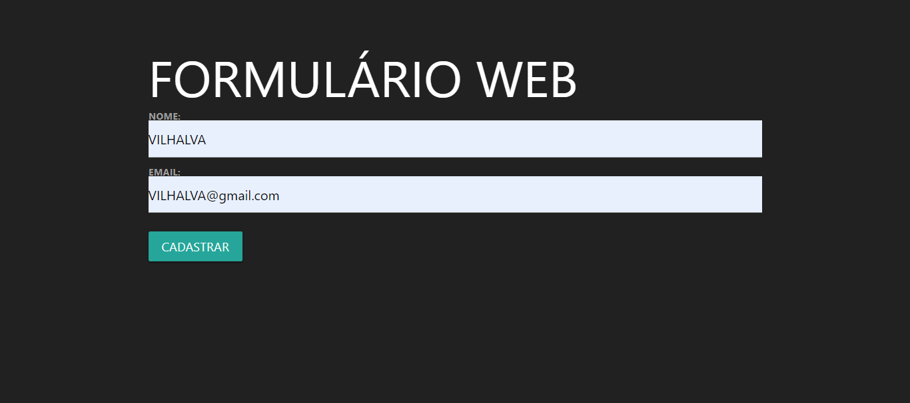
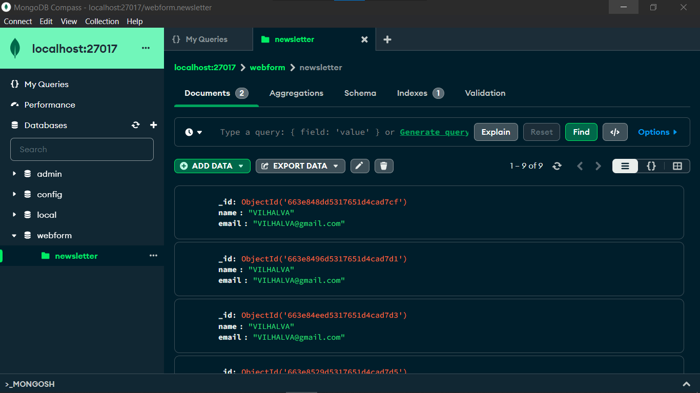

# CADASTRO COM GOLANG
👨‍🏫FORMULARIO DE CADASTRO DE NOME E EMAIL COM GOLANG E MONGODB.

 <br>
 <br>

## DESCRIÇÃO:
Este projeto consiste em um formulário web que permite aos usuários inserir seus nomes e endereços de e-mail. O formulário possui um visual atraente e moderno, utilizando o framework Materialize CSS para estilização.

Os elementos do formulário estão organizados em uma estrutura limpa e responsiva, garantindo uma boa experiência de usuário em diferentes dispositivos.

Quando o usuário preenche o formulário e clica no botão "Cadastrar", os dados inseridos são submetidos para serem salvos no banco de dados MongoDB. Isso significa que as informações fornecidas pelos usuários serão armazenadas de forma persistente em um banco de dados não relacional, o MongoDB.

O MongoDB é uma escolha comum para aplicativos web modernos devido à sua flexibilidade e escalabilidade, especialmente para dados sem uma estrutura definida, como informações de formulários web.

## EXECUTANDO O PROJETO:
1. **Conectando o MONGODB:**
   - Antes de você executar esse APP, você precisa conectar o MONGODB, e o  deixar ligado e em execução.

2. **Configuração do `connection.go`:** 
   - Certifique-se de ter um servidor MongoDB em execução localmente na porta padrão (27017), ou ajuste a URL de conexão de acordo com sua configuração (Na linha 14 do `./CODIGO/db/connection.go`).

3. **Iniciando o servidor:**
   - Para iniciar o servidor, execute o arquivo em `./CODIGO/main.go` com um dos seguintes comandos no terminal:
   ```bash
   go run .
   ```
   ou
   ```bash
   go run main.go
   ```

   - Após iniciar o servidor, acesse o projeto no navegador utilizando o seguinte URL: [http://localhost:4040/](http://localhost:4040/).

4. **Usando o APP:**
   1. Preencha os campos do formulário. Insira seu nome no campo "NOME" e seu endereço de e-mail no campo "EMAIL".

   2. Clique no botão "Cadastrar". Depois de preencher os campos do formulário, clique no botão "Cadastrar".

   3. Após preencher os campos do formulário e clicar em "Cadastrar", os dados serão enviados e salvos no MongoDB. Você pode visualizar o registro do seu cadastro diretamente no MongoDB, garantindo que suas informações tenham sido armazenadas com sucesso.

## NÃO SABE?
- Entendemos que para manipular arquivos em muitas linguagens e tecnologias, é necessário possuir conhecimento nessas áreas. Para auxiliar nesse aprendizado, oferecemos cursos gratuitos disponíveis:
* [CURSO DE GOLANG](https://github.com/VILHALVA/CURSO-DE-GOLANG)
* [CURSO DE MONGODB](https://github.com/VILHALVA/CURSO-DE-MONGODB)
* [CURSO DE HTML E CSS](https://github.com/VILHALVA/CURSO-DE-HTML-E-CSS)
* [CURSO DE MATERIALIZECSS](https://github.com/VILHALVA/CURSO-DE-MATERIALIZECSS)
* [CONFIRA MAIS CURSOS](https://github.com/VILHALVA?tab=repositories&q=+topic:CURSO)

## CREDITOS:
- [PROJETO FEITO PELO VILHALVA](https://github.com/VILHALVA)
- [VEJA O VIDEO DESSE PROJETO](https://youtu.be/QP0slFxVQKU?si=hHbqIhEsYaHpRoPg)
